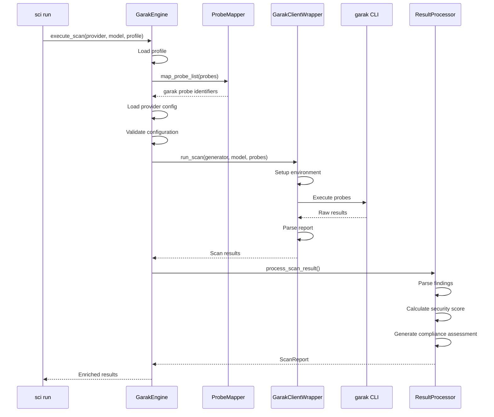

# Garak Framework Integration

This document provides comprehensive documentation for SCI's integration with the [garak](https://github.com/leondz/garak) framework, a powerful LLM security testing tool.

## Overview

SCI (Security-Centered Intelligence) integrates with garak to leverage its extensive library of security probes and detectors. The integration provides:

- **Seamless probe mapping**: SCI's semantic probe names map to garak's technical identifiers
- **Provider adapters**: Automatic configuration of authentication for multiple LLM providers
- **Result enrichment**: Garak findings are enriched with severity, compliance mapping, and recommendations
- **EU AI Act compliance**: Findings are automatically mapped to relevant EU AI Act articles

## Architecture

The garak integration consists of several components:

```
┌─────────────────────────────────────────────────────────────────────────┐
│                            GarakEngine                                   │
│  ┌─────────────┐  ┌──────────────┐  ┌─────────────┐  ┌───────────────┐ │
│  │ ProbeMapper │  │DetectorMapper│  │  Compliance │  │    Result     │ │
│  │             │  │              │  │   Mapper    │  │   Processor   │ │
│  └──────┬──────┘  └──────┬───────┘  └──────┬──────┘  └───────┬───────┘ │
│         │                │                 │                  │         │
│  ┌──────┴────────────────┴─────────────────┴──────────────────┴──────┐  │
│  │                      GarakClientWrapper                           │  │
│  │  ┌─────────────┐  ┌─────────────┐  ┌─────────────────────────┐   │  │
│  │  │ CLI Builder │  │Report Parser│  │  Environment Manager    │   │  │
│  │  └─────────────┘  └─────────────┘  └─────────────────────────┘   │  │
│  └───────────────────────────────────────────────────────────────────┘  │
└─────────────────────────────────────────────────────────────────────────┘
                                    │
                                    ▼
                            ┌───────────────┐
                            │  garak CLI    │
                            └───────────────┘
```

### Component Description

| Component | Description |
|-----------|-------------|
| `GarakEngine` | Main orchestration engine coordinating scan lifecycle |
| `GarakClientWrapper` | Python wrapper around garak CLI |
| `ProbeMapper` | Maps SCI probe names to garak probe identifiers |
| `DetectorMapper` | Maps SCI detector names to garak detector configurations |
| `ComplianceMapper` | Associates probes/detectors with EU AI Act articles |
| `GarakResultProcessor` | Transforms raw garak output into enriched reports |

## Installation

### Prerequisites

- Python 3.10 or later
- SCI framework installed

### Installing Garak

#### Using UV (Recommended)

```bash
# Add garak as a dependency
uv add 'garak>=0.13.3'

# Or sync with existing dependencies
uv sync
```

#### Using pip

```bash
pip install 'garak>=0.13.3'
```

### Verifying Installation

```bash
# Check garak version
python -c "import garak; print(garak.__version__)"

# Or use SCI to verify
sci run probes  # Should list available probes
```

## Configuration

### Basic Configuration

Add garak configuration to your `settings.yaml`:

```yaml
garak:
  enabled: true
  timeout: 60
  max_retries: 3
  parallelism: 10
  extended_detectors: true
```

### Full Configuration Reference

| Field | Type | Default | Description |
|-------|------|---------|-------------|
| `enabled` | bool | `true` | Enable garak integration |
| `timeout` | int | `60` | Request timeout in seconds (1-600) |
| `max_retries` | int | `3` | Maximum retry attempts (0-10) |
| `parallelism` | int | `10` | Parallel probe executions (1-100) |
| `limit_samples` | int | `null` | Limit samples per probe |
| `extended_detectors` | bool | `true` | Use extended detector set |
| `scan_timeout` | int | `600` | Overall scan timeout in seconds |
| `continue_on_error` | bool | `false` | Continue if individual probes fail |
| `probe_categories` | dict | `{}` | Custom probe name mappings |

### Probe Category Configuration

Map custom probe names to garak modules:

```yaml
garak:
  probe_categories:
    # Custom probe name -> garak module
    my_injection_test: promptinject
    custom_jailbreak: dan
```

## Probe Mapping

SCI provides semantic probe names that map to garak's technical identifiers.

### Built-in Probe Mappings

| SCI Probe Name | Garak Module | Description |
|----------------|--------------|-------------|
| `prompt_injection_basic` | `promptinject` | Basic prompt injection tests |
| `prompt_injection_advanced` | `promptinject` | Advanced prompt injection tests |
| `jailbreak_basic` | `dan` | DAN-style jailbreak attempts |
| `jailbreak_roleplay` | `dan` | Roleplay-based jailbreaks |
| `jailbreak_encoding` | `encoding` | Encoding-based jailbreaks |
| `extraction_system_prompt` | `leakreplay` | System prompt extraction tests |
| `extraction_training_data` | `leakreplay` | Training data extraction tests |
| `manipulation_output` | `malwaregen` | Output manipulation tests |
| `compliance_transparency` | `lmrc` | Transparency requirement tests |
| `compliance_human_oversight` | `lmrc` | Human oversight tests |

### Garak Module to Probes

Each garak module contains multiple specific probes:

| Module | Example Probes |
|--------|---------------|
| `promptinject` | `HumanJailbreaks`, `AutoDAN`, `HijackHateHumansMini` |
| `dan` | `DAN`, `DUDE`, `DANJailbreak`, `ChatGPT_Developer_Mode` |
| `encoding` | `InjectBase64`, `InjectHex`, `InjectROT13`, `InjectMorse` |
| `leakreplay` | `LiteratureCloze`, `GuardianCloze` |
| `malwaregen` | `Evasion`, `Payload`, `SubFunctions` |
| `lmrc` | `Anthropomorphisation`, `Bullying`, `Profanity` |

## Detector Mapping

SCI detectors map to garak detector configurations.

### Built-in Detector Mappings

| SCI Detector | Garak Detectors | Level | Threshold |
|--------------|-----------------|-------|-----------|
| `toxicity_basic` | `ToxicCommentModel` | basic | 0.5 |
| `toxicity_advanced` | `ToxicCommentModel`, `HateSpeechDetector` | advanced | 0.3 |
| `leakage_basic` | `TriggerListDetector` | basic | - |
| `leakage_pii` | `PIIDetector`, `StringDetector` | advanced | - |
| `bias_detection` | `BiasClassifier` | basic | - |
| `hallucination_factual` | `FactualConsistencyDetector` | advanced | - |

## EU AI Act Compliance Mapping

Probes and detectors are mapped to EU AI Act requirements.

### Article Mappings

| Probe Category | EU AI Act Articles | Risk Level |
|----------------|-------------------|------------|
| `prompt_injection` | Article 15, Article 9 | High |
| `jailbreak` | Article 15, Article 9 | High |
| `extraction` | Article 10, Article 13, Article 15 | High |
| `toxicity` | Article 9 | High |
| `bias` | Article 10, Article 9 | High |
| `transparency` | Article 13, Article 52 | Limited |
| `human_oversight` | Article 14 | High |

### Article Descriptions

| Article | Title |
|---------|-------|
| Article 9 | Risk Management System |
| Article 10 | Data and Data Governance |
| Article 13 | Transparency and Provision of Information |
| Article 14 | Human Oversight |
| Article 15 | Accuracy, Robustness and Cybersecurity |
| Article 52 | Transparency Obligations |
| Annex IV | Technical Documentation |

## Usage Examples

### Basic Scan Execution

```bash
# Run a standard security scan
sci run --provider openai --model gpt-4 --profile standard

# Dry run to preview execution
sci run --provider openai --model gpt-4 --profile standard --dry-run
```

### Python API

```python
from sci.config.manager import ConfigManager
from sci.config.models import GarakConfig
from sci.engine.garak_engine import GarakEngine
from pathlib import Path

# Initialize configuration
config_manager = ConfigManager()
config_manager.load()

garak_config = GarakConfig(
    parallelism=5,
    timeout=120,
    extended_detectors=True,
)

# Create engine
engine = GarakEngine(garak_config, config_manager)

# Execute scan
results = engine.execute_scan(
    provider_name="openai",
    model_name="gpt-4",
    profile_name="standard",
    output_dir=Path("./results"),
)

# Access results
print(f"Scan ID: {results['scan_id']}")
print(f"Status: {results['status']}")
print(f"Findings: {len(results['findings'])}")
```

### Custom Profile Creation

```yaml
# In settings.yaml
profiles:
  my_custom_profile:
    name: my_custom_profile
    description: Custom security testing profile
    probes:
      - prompt_injection_basic
      - prompt_injection_advanced
      - jailbreak_basic
      - extraction_system_prompt
    detectors:
      - toxicity_basic
      - leakage_basic
    compliance_tags:
      - article-9
      - article-15
    max_parallel: 5
    timeout: 300
```

### Multi-Provider Testing

```python
# Test the same profile across multiple providers
providers = ["openai", "anthropic", "google"]
results = {}

for provider in providers:
    config = load_provider_config(provider)
    results[provider] = engine.execute_scan(
        provider_name=provider,
        model_name=config.model,
        profile_name="comprehensive",
        output_dir=Path(f"./results/{provider}"),
    )
```

### Result Analysis

```python
# Analyze scan results
from sci.engine.results import GarakResultProcessor, ResultStorageManager

processor = GarakResultProcessor(sci_config)
report = processor.process_scan_result(raw_results)

# Check security score
print(f"Security Score: {report.security_score.overall_score}")
print(f"Risk Level: {report.security_score.risk_level}")

# Review compliance
for article in report.compliance_assessment.article_details:
    print(f"{article.article_id}: {article.status}")

# Get recommendations
for rec in report.recommendations:
    print(f"- {rec}")
```

## Provider Setup

### OpenAI

```yaml
providers:
  openai:
    api_key: ${OPENAI_API_KEY}
    model: gpt-4
```

```bash
export OPENAI_API_KEY="sk-your-key"
```

### Anthropic

```yaml
providers:
  anthropic:
    api_key: ${ANTHROPIC_API_KEY}
    model: claude-3-opus-20240229
```

### Azure OpenAI

```yaml
providers:
  azure:
    api_key: ${AZURE_OPENAI_KEY}
    endpoint: https://your-resource.openai.azure.com
    deployment_name: gpt-4-deployment
    api_version: 2024-02-15-preview
```

### AWS Bedrock

```yaml
providers:
  aws:
    access_key_id: ${AWS_ACCESS_KEY_ID}
    secret_access_key: ${AWS_SECRET_ACCESS_KEY}
    region: us-east-1
    model: anthropic.claude-v2
```

### Google AI

```yaml
providers:
  google:
    api_key: ${GOOGLE_API_KEY}
    project_id: your-project-id
    location: us-central1
    model: gemini-pro
```

### Hugging Face

```yaml
providers:
  huggingface:
    api_key: ${HF_TOKEN}
    model: meta-llama/Llama-2-7b-chat-hf
```

## Advanced Topics

### Custom Probe Mappings

Extend the probe mapping with custom entries:

```python
from sci.garak.mappings import extend_probe_mapping, generate_default_probe_mapping

# Get default mappings
base_mapping = generate_default_probe_mapping()

# Add custom mappings
custom_mapping = {
    "my_custom_probe": "my_garak_module",
    "another_probe": "another_module",
}

# Combine mappings
full_mapping = extend_probe_mapping(base_mapping, custom_mapping)
```

### Parallelism Tuning

Adjust parallelism based on your API rate limits:

```yaml
garak:
  # Conservative for rate-limited APIs
  parallelism: 3

  # Aggressive for high-throughput APIs
  parallelism: 20
```

### Timeout Configuration

Configure timeouts for different scenarios:

```yaml
garak:
  # Per-request timeout
  timeout: 60

  # Overall scan timeout
  scan_timeout: 1800  # 30 minutes

  # Connection validation timeout
  connection_timeout: 30
```

### Error Recovery

Enable continue-on-error for large scans:

```yaml
garak:
  continue_on_error: true
  max_retries: 5
```

This creates checkpoints that allow resuming failed scans:

```bash
# Resume from checkpoint
sci run --provider openai --model gpt-4 \
    --resume-checkpoint ./results/checkpoint_abc123.json
```

## Scan Execution Flow



## API Reference

### GarakEngine

```python
class GarakEngine:
    """Main orchestration engine for security scans."""

    def __init__(
        self,
        config: GarakConfig,
        config_manager: ConfigManager,
    ) -> None: ...

    def execute_scan(
        self,
        provider_name: str,
        model_name: str,
        profile_name: str,
        output_dir: Path,
        progress_callback: Optional[ProgressCallback] = None,
        resume_checkpoint: Optional[Path] = None,
    ) -> dict[str, Any]: ...

    def validate_configuration(
        self,
        provider_name: str,
        profile_name: str,
        validate_connectivity: bool = False,
    ) -> dict[str, Any]: ...

    def get_profile(self, profile_name: str) -> Optional[TestProfile]: ...
    def list_available_profiles(self) -> list[str]: ...
    def list_probes(self, category: Optional[str] = None) -> list[dict]: ...
    def list_detectors(self, category: Optional[str] = None) -> list[dict]: ...
```

### GarakClientWrapper

```python
class GarakClientWrapper:
    """Wrapper for the garak security testing framework."""

    def __init__(self, config: GarakConfig) -> None: ...

    def run_scan(
        self,
        generator_type: str,
        model_name: str,
        probes: list[str],
        env_vars: dict[str, str],
        **kwargs: Any,
    ) -> dict[str, Any]: ...

    def validate_installation(self) -> bool: ...
    def validate_connection(self, generator_type: str, env_vars: dict) -> bool: ...
    def list_available_probes(self) -> list[str]: ...
    def list_available_generators(self) -> list[str]: ...
```

### GarakResultProcessor

```python
class GarakResultProcessor:
    """Processes raw garak scan results into standardized format."""

    def __init__(self, config: SCIConfig) -> None: ...

    def process_scan_result(self, raw_result: dict) -> ScanReport: ...
```

## See Also

- [Configuration Reference](configuration.md)
- [Troubleshooting Guide](troubleshooting-garak.md)
- [CLI Reference](cli-reference.md)
- [Garak Documentation](https://github.com/leondz/garak)
